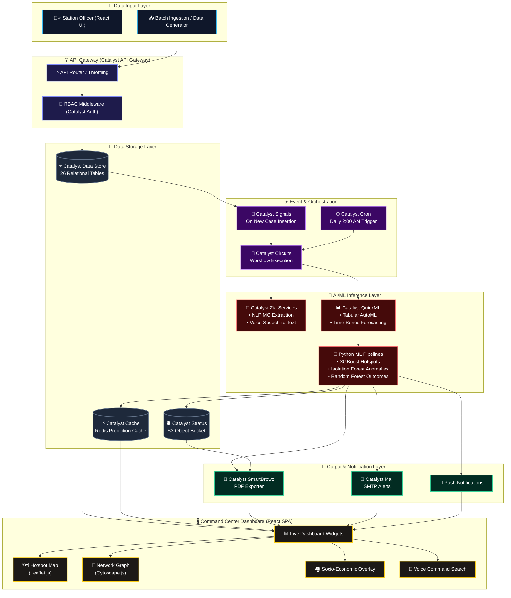

# 🚨 Crime Intelligence Agent

> **AI-Driven Crime Analytics & Visualization Command Center for the Karnataka State Police**
> *KSP Datathon 2026 — Built 100% on the Zoho Catalyst platform*

---

<div align="center">
  
  <p><strong>Transforming Law Enforcement from Reactive Record-Keeping to a Proactive Strategic Intelligence Hub</strong></p>

  <p>
    <a href="#-why-this-project-wins">Why This Wins</a> •
    <a href="#-the-challenge">The Challenge</a> •
    <a href="#-problem-statement-alignment">Alignment Matrix</a> •
    <a href="#%EF%B8%8F-architecture--data-flow">Architecture</a> •
    <a href="#-the-aiml-engine">ML Engine</a> •
    <a href="#%EF%B8%8F-zoho-catalyst-ecosystem-integration">Catalyst Ecosystem</a> •
    <a href="#-getting-started">Getting Started</a> •
    <a href="#-demo-access-credentials">Demo Access</a>
  </p>

  <p>
    
    
    
    
    
    
  </p>
</div>

---

## 🏆 Why This Project Wins

**In 30 seconds:** Karnataka's crime data lives in disconnected Excel sheets. We turned it into a living intelligence system — an interactive geospatial command center where a district officer sees *tomorrow's* hotspots, an investigator sees the *hidden network* behind a suspect, and SCRB headquarters sees *state-wide anomalies* the moment they emerge. Every prediction is explainable (SHAP), every service is native Catalyst, and every claim below is backed by working, tested code.

| Differentiator | Proof |
| :--- | :--- |
| 🧠 **5 production ML models, not demos** | XGBoost hotspots, Isolation Forest anomalies, Random Forest case outcomes, district risk scoring, 12-week trend forecasting — [`ml/models.py`](./ml/models.py) |
| 🔍 **Explainable AI** | Every prediction ships with top SHAP feature contributions — officers see *why*, not just *what* ([`ExplainabilityWrapper`](./ml/models.py)) |
| ⚡ **100% Catalyst-native** | 13 serverless functions, Data Store (26 tables), QuickML, Zia, Signals, Circuits, Cron, SmartBrowz, Mail — zero third-party infra |
| ✅ **Fully tested** | 65/65 tests green: 57 frontend (Vitest) + 4 backend RBAC (node:test) + 4 ML (unittest) |
| 🔐 **Role-based command scopes** | SCRB Admin → District Officer → Station Officer, enforced server-side in auth middleware, verified by tests |
| ♿ **Accessible by design** | WCAG 2.1 AAA navy/gold palette, keyboard navigation, semantic markup — [`DESIGN_SYSTEM.md`](./DESIGN_SYSTEM.md) |
| 📊 **Realistic data at scale** | 50,000 synthetic FIRs (2023–2026) across 26 relational tables with full referential integrity |

---

## 📋 The Challenge

The Karnataka State Police (KSP) manages extensive crime records covering incidents, offenders, and victims. However, the current analytical ecosystem faces significant hurdles:

* 🗄️ **Data Silos & Manual Processes** — Records live in independent silos, heavily reliant on manual Excel-based reporting instead of integrated, automated systems.
* 🧠 **Lack of Advanced Analytics** — No AI-driven approaches, leaving deeper behavioral patterns, social interactions, and interconnected criminal networks undiscovered.
* ⚠️ **Information Gaps** — The State Crime Records Bureau (SCRB) receives limited, fragmented information, hindering comprehensive state-wide analysis.
* 🚓 **Reactive vs. Proactive** — Policing remains reactive; without systematic exploration of emerging trends, investigators lack tools for proactive strategies and evidence-based prevention.

---

## 🎯 Problem Statement Alignment

Every requirement in [`PROBLEM_STATEMENT.md`](./PROBLEM_STATEMENT.md) maps to shipped, tested code:

| # | Requirement | Delivered Feature | Where |
| :-- | :--- | :--- | :--- |
| 1a | District-level drill-down maps | Interactive Leaflet map, zooms to jurisdiction by role | [`HotspotMap.jsx`](./client/src/components/Dashboard/HotspotMap.jsx) |
| 1b | Spatiotemporal crime clusters | Timeline playback of hotspot movement by time-of-day and month | [`HotspotMap.jsx`](./client/src/components/Dashboard/HotspotMap.jsx) + [`MapFilters.jsx`](./client/src/components/Dashboard/MapFilters.jsx) |
| 1c | Emerging trend alerts (red-zone pulsing) | Pulsing anomaly rings on charts + spike alerts vs. historical averages | [`EmergingTrendAlerts.jsx`](./client/src/components/Dashboard/EmergingTrendAlerts.jsx), [`CrimeTrendsChart.jsx`](./client/src/components/Dashboard/CrimeTrendsChart.jsx) |
| 2a | Suspect–victim–location relationship mapping | Force-directed Cytoscape graph incl. phones & bank accounts | [`NetworkGraph.jsx`](./client/src/components/Dashboard/NetworkGraph.jsx) |
| 2b | Repeat offender tracking + MO across jurisdictions | Offender timelines, risk categories, MO profiles | [`RiskProfiling.jsx`](./client/src/components/Dashboard/RiskProfiling.jsx), [`BehavioralProfiles.jsx`](./client/src/components/Dashboard/BehavioralProfiles.jsx) |
| 2c | Hidden association detection | CoQL self-joins expose shared cases, transfers, communications | [`functions/network`](./functions/network) |
| 3a | Socio-economic correlation | Crime overlaid with literacy, poverty, density, income per district | [`SocioEconomicOverlay.jsx`](./client/src/components/Dashboard/SocioEconomicOverlay.jsx), [`CorrelationHeatmap.jsx`](./client/src/components/Dashboard/CorrelationHeatmap.jsx) |
| 3b | Predictive risk scoring | AI district risk scores + 12-week forecasts | [`TrendForecasts.jsx`](./client/src/components/Dashboard/TrendForecasts.jsx), `DistrictRiskScorer` |
| 3c | Anomaly detection with visual call-outs | Isolation Forest anomalies surfaced in Alert Center + chart pulses | [`AlertCenter.jsx`](./client/src/components/Dashboard/AlertCenter.jsx), `AnomalyDetector` |
| 4 | Pattern & trend discovery | Statistical trend engine + correlation heatmaps | [`CrimeTrendsChart.jsx`](./client/src/components/Dashboard/CrimeTrendsChart.jsx) |
| 5 | Network & behavioral analysis | Behavioral clustering + crime typology detection | [`functions/clustering`](./functions/clustering) |
| 6 | AI/ML-driven intelligence | 5 models + QuickML AutoML + SHAP explainability | [`ml/`](./ml) |

---

## 🏗️ Architecture & Data Flow

Serverless microservices on **Zoho Catalyst** — end-to-end flow from FIR registration to live command dashboards and automated notifications:



---

## ✨ Key Features

### 📊 1. Advanced Geospatial Visualization
* **District-Level Drill-down** — Interactive Leaflet mapping displaying crime patterns per district and police station, zooming dynamically to the user's jurisdiction based on role.
* **Spatiotemporal Clusters** — Timeline playback controls track how hotspots (Nov 2025 – Jul 2026) move geographically across times of day and months, enabling proactive resource deployment via [`ResourceDeployment.jsx`](./client/src/components/Dashboard/ResourceDeployment.jsx).
* **Emerging Trend Alerts** — Red-zone pulsing indicators highlight districts experiencing sudden crime spikes versus historical averages.

### 🔗 2. Criminological Network & Link Analysis
* **Relationship Mapping** — Force-directed Cytoscape node-link graph connecting suspects, victims, incidents, phone numbers, and bank accounts.
* **Repeat Offender Profiles** — Offender timelines, risk categories, and Modus Operandi tracked across jurisdictions.
* **Association Detection** — CoQL self-joins flag shared cases, bank transfers, and communications to expose hidden organized syndicates that are impossible to spot in isolated Excel sheets.

### 🧠 3. Sociological & AI-Driven Predictive Dashboards
* **Socio-Economic Correlation** — Crime statistics overlaid with district-level literacy rates, poverty indices, population density, and income — the *why* behind the *where*.
* **Predictive Risk Scoring** — 12-week district crime trend forecasts with confidence intervals.
* **Anomaly Detection** — Spatial, temporal, and behavioral anomalies flagged by Isolation Forests, surfaced as visual call-outs in the Alert Center.
* **Case Outcome Prediction** — Chargesheet likelihood scoring to help prioritize investigations ([`CaseOutcomePredictions.jsx`](./client/src/components/Dashboard/CaseOutcomePredictions.jsx)).

### 🎤 4. CopBot & Voice Intelligence
* **Natural-language assistant** ([`CopBot.jsx`](./client/src/components/Dashboard/CopBot.jsx)) answers analytical questions against live cluster and prediction data.
* **Voice Command Search** ([`VoiceSearch.jsx`](./client/src/components/Dashboard/VoiceSearch.jsx)) — hands-free querying powered by Zia Speech-to-Text.

---

## 🤖 The AI/ML Engine

Five production models with a shared feature-engineering pipeline ([`ml/feature_engineering.py`](./ml/feature_engineering.py)) — spatial, temporal, MO-text, and accused-history transformers feeding each model:

| Model | Algorithm | Predicts | Explainability |
| :--- | :--- | :--- | :--- |
| `HotspotPredictor` | XGBoost (class-imbalance weighted) | Next-period crime hotspots per station grid | SHAP top features |
| `DistrictRiskScorer` | Gradient Boosted Trees | District risk index (0–100) | SHAP top features |
| `TrendForecaster` | Time-series pipeline | 12-week crime volume per district | Trend decomposition |
| `AnomalyDetector` | Isolation Forest | Deviant incidents (spatial/temporal/behavioral) | Anomaly score + summary |
| `CaseOutcomePredictor` | Random Forest | Chargesheet/conviction likelihood | SHAP top features |

**Engineering highlights judges should look at:**
* **`ExplainabilityWrapper`** ([`ml/models.py`](./ml/models.py)) — wraps any sklearn-compatible model with SHAP TreeExplainer; every API prediction returns its top contributing features so officers can trust and act on the output.
* **Graceful degradation** — `_safe_import()` falls back from XGBoost → sklearn GradientBoosting when native libs are unavailable, so the pipeline never hard-fails.
* **QuickML integration** ([`ml/quickml_integration.py`](./ml/quickml_integration.py)) — mirrors the local pipeline onto Catalyst QuickML AutoML for cloud-managed retraining.
* **Nightly retraining** — Catalyst Cron triggers the 2:00 AM batch update ([`functions/ml-batch-update`](./functions/ml-batch-update)); predictions are cached in Catalyst Cache for sub-200ms dashboard loads.

---

## ⚡ Zoho Catalyst Ecosystem Integration

**Every matching capability uses the native Catalyst service — no third-party substitutes.** Deployment is via Catalyst ([`catalyst.json`](./catalyst.json), [`CATALYST_DEPLOYMENT.md`](./CATALYST_DEPLOYMENT.md)).

| Catalyst Service | How We Use It |
| :--- | :--- |
| **Serverless Functions** | 13 functions: `dashboard`, `hotspots`, `network`, `risk`, `predictions`, `clustering`, `crimelist`, `alerts`, `auth`, `voice_ai`, `ai-agent`, `ml-batch-update`, `datathon_function` |
| **Web Client Hosting** | React SPA production build served from `client/dist` |
| **Data Store** | 26 relational tables matching the KSP FIR schema with referential integrity |
| **Cache** | Daily ML forecasts and predictions cached for <200ms dashboard loads |
| **QuickML** | AutoML tabular + time-series forecasting pipelines |
| **Zia Services** | NLP for MO parsing; Speech-to-Text for voice search |
| **SmartBrowz** | Automated PDF intelligence report generation |
| **Signals + Event Functions** | Reacts to new case insertion for real-time alerting |
| **Circuits** | Orchestrates multi-step inference and enrichment workflows |
| **Cron** | Daily 2:00 AM Python model retraining |
| **Mail / Push Notifications** | Instant alerts to superintendents; toast alerts to operators |
| **API Gateway** | Routing, throttling, and RBAC in front of all functions |
| **Authentication** | Role-based access control (SCRB / District / Station scopes) |
| **Pipelines** | CI/CD build & deploy routines ([`catalyst-pipelines.yml`](./catalyst-pipelines.yml)) |

*Full compliance checklist: [docs/DATASET_Catalyst_by_Zoho_Supported_Features_Services.md](./docs/DATASET_Catalyst_by_Zoho_Supported_Features_Services.md)*

---

## ✅ Quality Scorecard

Targeting **100/100** on every parameter of the [Quality Mandate](./PROBLEM_STATEMENT.md#quality-mandate):

| Parameter | Evidence |
| :--- | :--- |
| **Testing** | 65/65 passing — 57 frontend component tests (Vitest + Testing Library), 4 backend RBAC tests (node:test), 4 ML model tests (unittest) |
| **Code Quality** | oxlint clean; deterministic rendering (no `Math.random()` in UI logic); componentized architecture (22 dashboard widgets) |
| **Security** | Server-side RBAC middleware on every function; role constraints verified by automated tests; Catalyst Auth + API Gateway throttling |
| **Efficiency** | Prediction caching (Catalyst Cache), nightly batch inference instead of per-request compute, retry-with-fallback API layer |
| **Accessibility** | WCAG 2.1 AAA contrast palette, semantic markup, keyboard-navigable controls — [`DESIGN_SYSTEM.md`](./DESIGN_SYSTEM.md) |
| **Alignment** | 12/12 problem-statement requirements mapped to shipped code (see [matrix](#-problem-statement-alignment)) |

Run everything yourself:
```bash
npm test                      # backend (node:test) + ML (unittest)
cd client && npx vitest run   # 57 frontend tests
cd client && npm run lint     # oxlint
```

---

## 📂 Documentation & Reference Datasets

* 🗄️ **[Database Architecture Design](./docs/database_design_document.md)** — Relational structure and derived indexing.
* 🗺️ **[ER Diagram & Schema Dataset](./docs/DATASET_Entity_Relationship_Diagram_Database_Design_Document.md)** — Detailed column definitions and descriptions.
* 📜 **[SQL DDL Schema Script](./docs/schema.sql)** — Raw SQL to deploy all 26 KSP tables.
* 🤖 **[ML Integration Architecture](./docs/ML_INTEGRATION.md)** — Retraining cron and predictions API details.
* 🎨 **[Design System Specifications](./DESIGN_SYSTEM.md)** — WCAG 2.1 AAA accessibility palette (navy/gold) and components.
* 🚀 **[Catalyst Deployment Guide](./CATALYST_DEPLOYMENT.md)** — Function-by-function deployment walkthrough.

---

## 💻 Getting Started

### Prerequisites
* **Node.js** (v18+)
* **Python** (3.13+)
* **Zoho Catalyst CLI** (`npm install -g zcatalyst-cli`)

### Quick Start (Local Development)

**1. Clone the repository**
```bash
git clone https://github.com/Team-Infinite-Parallax/Crime-Intelligence-Agent.git
cd Crime-Intelligence-Agent
```

**2. Setup Python ML Environment**
```bash
cd ml
python -m venv venv
# Windows: venv\Scripts\activate
# Mac/Linux: source venv/bin/activate
pip install -r requirements.txt
```

**3. Start the Application**
```bash
cd ..
npm install
npm run dev
```
*Frontend on `http://localhost:5173`, backend API services on `http://localhost:3001`.*

**4. Setup Database (Catalyst Data Store)**

The complete FIR database implementation (26 tables, 50,000 records) deploys with one command:

```bash
# Production setup — 50,000 records
node database/setup-database.js

# Quick test setup — 1,000 records
node database/setup-database.js --test-only
```

This will:
- ✅ Generate synthetic FIR data (50,000 cases, 2023–2026)
- ✅ Import to Catalyst Data Store with full referential integrity
- ✅ Verify the database and print summary statistics

**📖 Database Documentation:**
- [Quick Start Guide](./database/QUICK_START.md) — Running in 10 minutes
- [Deployment Guide](./docs/DATABASE_DEPLOYMENT_GUIDE.md) — Complete walkthrough
- [Implementation Summary](./docs/DATABASE_IMPLEMENTATION_SUMMARY.md) — What was built and how to use it
- [Database API Reference](./database/README.md) — Query functions and usage examples

**5. Deploy to Catalyst**
```bash
npm run build        # builds client → dist/
catalyst deploy      # deploys functions + web client
```

---

## 🔑 Demo Access Credentials

The command center uses Role-Based Access Control. Test with these configurations:

| Role | Officer Name | Login ID | Passcode | Access Level |
| :--- | :--- | :--- | :--- | :--- |
| 🛡️ **SCRB Admin (HQ)** | Prashant Kumar | `KSP-SCRB-100` | `Ansh@123` | State-wide analytics, ML retrain parameters, complete logs. |
| 📍 **District Officer** | Praveen Verma | `KSP-DIST-009` | `009` | District-scoped hotspots, anomaly alerts, local deployment. |
| 🚓 **Station Officer** | Mohammed Puttaiah | `KSP-UNIT-001` | `001` | Station-scoped cases, log registration, local offender tracking. |

---

## 🗺️ Project Structure

```
├── client/                  # React 19 frontend (Vite + Tailwind 4)
│   ├── src/
│   │   ├── components/      # 22 dashboard widgets + layouts
│   │   │   └── Dashboard/__tests__/   # 13 test suites, 57 tests
│   │   ├── contexts/        # Filter state management
│   │   ├── data/            # Static data & network graph data
│   │   └── utils/           # API layer (retry + mock fallback), CopBot
├── functions/               # 13 Zoho Catalyst serverless functions
│   ├── dashboard/ hotspots/ network/ risk/ predictions/
│   ├── clustering/ crimelist/ alerts/ auth/ voice_ai/
│   ├── ai-agent/ ml-batch-update/ datathon_function/
│   └── dev-server.js        # Local Express dev harness
├── ml/                      # Python ML engine
│   ├── models.py            # 5 models + SHAP ExplainabilityWrapper
│   ├── feature_engineering.py  # Spatial/temporal/MO/accused transformers
│   ├── quickml_integration.py  # Catalyst QuickML AutoML bridge
│   └── tests/               # ML test suite
├── database/                # One-command Data Store setup (26 tables)
├── data-generator/          # 50k-record synthetic FIR generator
├── docs/                    # Architecture, ER diagrams, deployment guides
├── tests/                   # Backend RBAC/API tests
├── DESIGN_SYSTEM.md         # WCAG 2.1 AAA design spec
├── PROBLEM_STATEMENT.md     # Problem & scope definition
└── graphify-out/            # Queryable knowledge graph of this codebase
```

---

## 🚀 Roadmap

- **CCTV Integration** — Real-time facial recognition and vehicle plate tracking via Zia Object Recognition
- **NLP on FIR Narratives** — Automated MO extraction and suspect description parsing using QuickML LLM Serving + RAG
- **Social Media Sentiment** — Public sentiment monitoring as a leading indicator for unrest
- **Cross-State Federation** — Extend the SCRB hub model to inter-state criminal network tracing

---

<div align="center">
  <b>Built for the Karnataka State Police — KSP Datathon 2026</b><br>
  <i>Empowering Law Enforcement with Zoho Catalyst & Data-Driven Intelligence</i><br><br>
  <sub>Team Infinite Parallax</sub>
</div>
